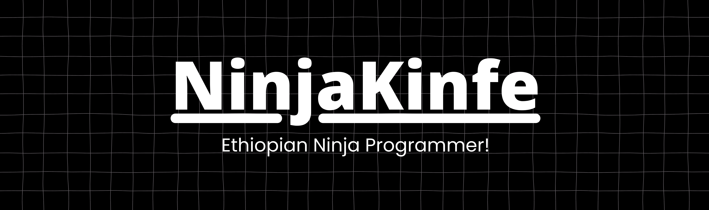

# Hello World! I'm Ninja Kinfe, Ethiopian Ninja Programmer!
👨🏼‍💻 At the age of 10, I wrote my first "Hello World" program, marking the beginning of my programming journey. 👨🏼‍🎓 I’m still learning and growing every day to master the art of programming. 

# 💫 About Me:
🛠️ Skills & Expertise: - Frontend Development: HTML, CSS - Desktop Software Development: Python  🌱 Currently Learning: - Advanced Python frameworks for software development - Flutter for mobile app development

# 💻 Tech Stack:
    

# 📊 GitHub Stats:

